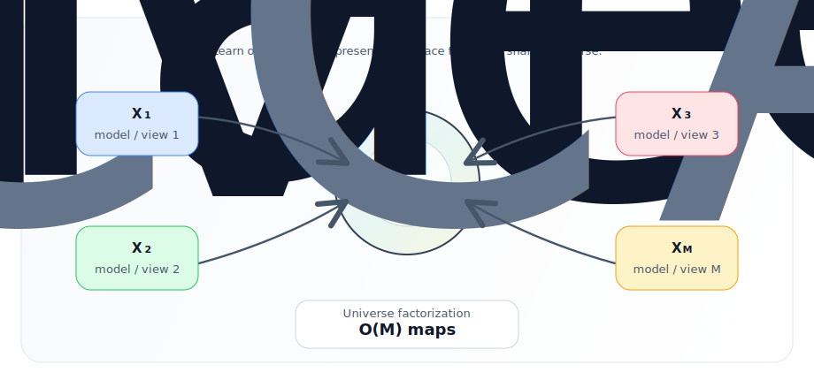

# Multi-Way Representation Alignment

Code accompanying the paper:

**Multi-Way Representation Alignment**

Akshit Achara, Tatiana Gaintseva, Mateo Mahaut, Pritish Chakraborty, Viktor Stenby Johansson, Melih Barsbey, Emanuele Rodolà, Donato Crisostomi | [PDF](https://openreview.net/pdf?id=ALLqzCD2RA)

This repository implements methods for aligning `M >= 3` independently trained representation spaces through a shared reference, or **universe**, instead of learning a separate map for every pair of models. The universe factorization learns one map per model, enabling any-to-any translation by composition while reducing the number of learned maps from `O(M^2)` to `O(M)`.

<p align="center">
  
</p>

The implementation includes a pairwise baseline and three families of multi-way alignment methods:

- **PW**: independent pairwise Procrustes alignment. It learns separate pairwise maps and serves as a direct baseline, but does not impose a global universe.
- **GPA**: Generalized Procrustes Analysis adapted to neural representations. It learns an orthogonal universe and preserves each model's internal geometry, which is useful for probing, stitching, and other geometry-sensitive tasks.
- **GCCA**: a shared-basis agreement-maximizing baseline. It is strong for retrieval because it does not preserve internal geometry, which gives it more flexibility to reduce cross-view mismatch.
- **GCPA**: Geometry-Corrected Procrustes Alignment. It first fits the GPA universe, then applies a lightweight shared correction in universe coordinates to reduce residual directional mismatch while staying anchored to the Procrustes reference.

## Quickstart

Install [`uv`](https://github.com/astral-sh/uv), place this repository and `latentis` side by side, then sync the locked environment:

```sh
git clone https://github.com/acharaakshit/multiway-alignment
git clone https://github.com/crisostomi/latentis
cd multiway-alignment
uv sync --locked

export DATA_PATH=/path/to/data
```

The project uses an editable `latentis` dependency at `../latentis`. If your `latentis` checkout lives elsewhere, either symlink it to `../latentis` or update `[tool.uv.sources]` in `pyproject.toml`.

## Library Usage

| Method | Implementation |
| --- | --- |
| PW | `latentis.transform.translate.aligner.Translator` |
| GPA / GCPA | `cycloreps.translator.gpa.GeneralizedProcrustesTranslator` |
| GCCA | `cycloreps.translator.gcca.GeneralizedCCATranslator` |

Use `gc_enabled=False` for GPA and `gc_enabled=True` for GCPA.

All spaces passed to `fit` must contain matched samples in the same row order.

Minimal example:

```python
from cycloreps.translator.gpa import GeneralizedProcrustesTranslator

# spaces maps view/model names to tensors with matched rows:
# {"model_a": X_a, "model_b": X_b, "model_c": X_c}
translator = GeneralizedProcrustesTranslator(gc_enabled=True, device="cuda")
translator.fit(spaces)

u_a = translator.to_universe(spaces["model_a"], src="model_a")
x_a_to_b = translator.transform(spaces["model_a"], src="model_a", tgt="model_b")
```

Dataset layout and evaluations are described below.

## Data

The evaluations use the following datasets:

- **CIFAR-100** for geometric interoperability, weak-link stabilization, and universe extension.
- **MASSIVE** (`AmazonScience/massive`) for intent clustering in a shared universe.
- **TED-Multi** (`neulab/ted_multi`) for multilingual sentence retrieval.
- **Market-1501** for cross-camera person re-identification:
  [Google Drive](https://drive.google.com/file/d/0B8-rUzbwVRk0c054eEozWG9COHM/view?resourcekey=0-8nyl7K9_x37HlQm34MmrYQ)
- **Flickr8k** for multimodal image-text-audio retrieval:
  [text](https://github.com/jbrownlee/Datasets/releases/download/Flickr8k/Flickr8k_text.zip),
  [images](https://github.com/jbrownlee/Datasets/releases/download/Flickr8k/Flickr8k_Dataset.zip),
  [audio](https://groups.csail.mit.edu/sls/downloads/flickraudio/downloads/flickr_audio.tar.gz)

Experiments expect data under `DATA_PATH`. A typical layout is:

```text
$DATA_PATH/
|-- cifar100/                         # CIFAR image representations
|   `-- <kind>/<mode>/<encoder>/<split>/
|-- massive_<locale>/                 # MASSIVE text representations
|   `-- encodings/sample_complexity/<encoder>/<split>/
|-- ted_multi/
|   |-- encodings/<encoder>/<split>/
|   `-- ted_multi_instance_ids.pkl
|-- Market-1501-v15.09.15/            # raw Market-1501 dataset
|-- market1501/                       # per-camera Market-1501 image representations
|   `-- <dataset_name>/cam_<id>/<encoder>/<split>/
|-- flickr8k/                         # raw Flickr8k files
|   |-- Flicker8k_Dataset/
|   |-- Flickr8k_text/
|   `-- flickr_audio/wavs/
`-- flickr_logml/                     # Flickr8k representations
```

## Experiments

Launch experiments from the repository root after setting `DATA_PATH`. Configuration is managed with Hydra, so values can be adjusted from the command line when needed.

### CIFAR-100 Probing

```sh
uv run python -m scripts.exps.4_semantic --config-name 4_semanticity.yaml
```

Related CIFAR-100 experiments: `4_semantic_addition.yaml` and `4_semantic_corruption.yaml`. Together, these cover geometric interoperability, including weak pairwise links and adding new models into an existing universe.

### MASSIVE Universal Clustering

```sh
uv run python -m scripts.exps.10_universal_clustering
```

This evaluates whether mapping multiple pretrained text encoders into a shared universe improves unsupervised intent clustering.

### TED-Multi Multilingual Retrieval

Prepare TED-Multi text representations under `${DATA_PATH}/ted_multi/encodings/<encoder>/<split>/`:

```sh
uv run python -m scripts.embed.embed_texts_multilingual_retrieval
```

Multilingual retrieval can be run with `scripts.exps.9_multiret`.

When comparing numbers, use the same TED-Multi train/test split that was used to generate the text embeddings. Regenerating embeddings with different `transformers` or `latentis` versions can shift exact scores because tokenization behavior may differ across versions. The overall trends should remain similar.

A representative clean language-scaling experiment is:

```sh
uv run python -m scripts.exps.9_multiret --config-name 9_multiret_m3
```

Additional clean settings: `9_multiret_m3_diverse`, `9_multiret_m5`, and `9_multiret_m5_diverse`.

For a clean 10-model setting, run `9_multiret_m10` without the correspondence-noise fields:

```sh
uv run python -m scripts.exps.9_multiret --config-name 9_multiret_m10 run_name=9_multiret_m10_clean '~permute_views_sets' '~permute_fraction' '~permute_seed'
```

The correspondence-noise robustness setting uses `9_multiret_m10`; it permutes 75% of training correspondences for the three reported triads and reports each triad separately.

```sh
uv run python -m scripts.exps.9_multiret --config-name 9_multiret_m10
```

### Market-1501 Cross-Camera Retrieval

```sh
uv run python -m scripts.exps.3_reid
```

This treats each selected camera as a separate representation space and evaluates zero-shot cross-camera retrieval. It uses the raw dataset at `${DATA_PATH}/Market-1501-v15.09.15`; per-camera representations are kept under `${DATA_PATH}/market1501/<dataset_name>/cam_<id>/<encoder>/<split>/`.

File-order lists are included in `metadata/market1501/` if you need to match the original Market-1501 ordering exactly.

### Flickr8k Multimodal Retrieval

```sh
uv run python -m scripts.exps.2_scaffolding
```

This aligns text, image, and audio encoders, including BERT, DINOv2, CLIP, and HuBERT variants.

### GCPA Geometry Sweep

```sh
uv run python -m scripts.exps.11_geometry
```

This measures the geometry drift introduced by the GCPA correction for different correction thresholds and trust weights.

### GCPA Settings

For probing, GCPA is evaluated both with and without norm rescaling. Setting `gc_rescale=True` can improve probing performance because linear classifiers are scale-sensitive and the correction otherwise emphasizes directions. We keep rescaling off when the directional effect of the correction is the quantity of interest. The default `gc_rescale=False` is appropriate for retrieval and clustering, where cosine-normalized or directional comparisons are used.

GCPA correction strength is controlled in `config/alignment.yaml`. If the correction appears to over-correct a representation space, use fewer correction updates or a smaller learning rate. For stricter geometry preservation, lower the correction threshold or increase the geometry-preservation weight.

## Project Structure

```text
.
|-- config/                  # Experiment settings
|-- metadata/                # Reproducibility metadata
|-- src/
|   |-- cycloreps/           # Multi-space translators and utilities
|   |   |-- translator/      # GPA, GCPA, GCCA, and related translators
|   |   `-- utils/
|   `-- scripts/
|       |-- exps/            # Experiments
|       |-- embed/           # Embedding utilities
|       |-- dataset_utils.py # Dataset adapters for local/HF-style datasets
|       `-- exp_utils.py
|-- pyproject.toml
|-- uv.lock
`-- README.md
```

Experiment outputs are saved under `results/` by default, or under the output path selected in the corresponding configuration.

To add a new dataset, follow the adapter pattern in `src/scripts/dataset_utils.py`: build a `latentis.data.dataset.HFDatasetView` with stable sample ids, split names, and typed features, then use that view in the relevant embedding or evaluation workflow.

## Citation

If you use this code, please cite:

```bibtex
@article{achara2026multi,
  title={Multi-Way Representation Alignment},
  author={Achara, Akshit and Gaintseva, Tatiana and Mahaut, Mateo and Chakraborty, Pritish and Johansson, Viktor Stenby and Barsbey, Melih and Rodol{\`a}, Emanuele and Crisostomi, Donato},
  journal={arXiv preprint arXiv:2602.06205},
  year={2026}
}
```

## License

This project is licensed under the MIT License. See [LICENSE](LICENSE) for details.
